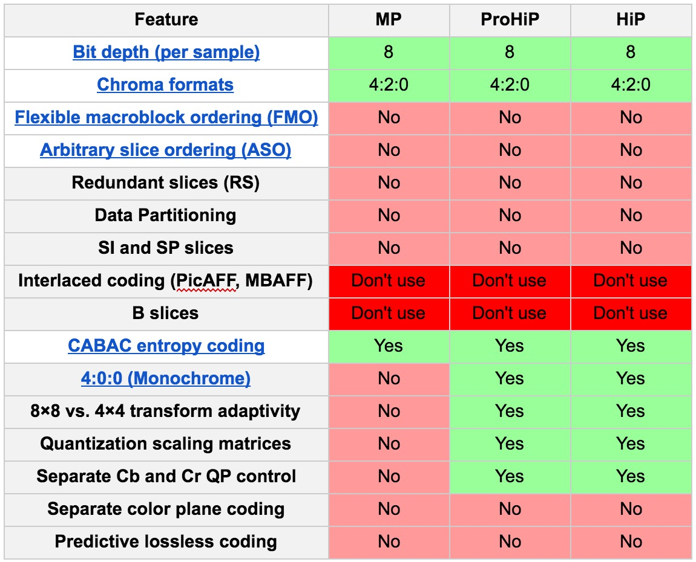

# Generic Proxy

## Quick Start

MP4 Container 

H264 High Profile (no B frames please)

AAC LC multiple audio tracks with multiple channels per track supported

Encoders Rule of Thumb: your resulting video file must be playable at least in Chrome on a desktop computer, best if it plays in Safari, Firefox and IE (latest versions)

## Container

MP4 

https://en.wikipedia.org/wiki/MPEG-4_Part_14 

Fast start option enabled (moov header at the beginning of the file) 

## <a id="GenericProxy_video"></a>Video

One video track

Resolution: preserve original resolution

Display Aspect Ratio: preserve original

Pixel Aspect Ratio: square pixel 1:1

#### Example #1 (Full HD):

Original Display Aspect Ratio: 16:9

Original Encoded resolution: 1920x1080

Original Pixel Aspect Ratio: 1:1

Output Display Aspect Ratio: 16:9

Output Encoded resolution: 1920x1080

Output Pixel Aspect Ratio: 1:1

#### Example #2 (Anamorphic widescreen):

Original Display Aspect Ratio: 16:9

Original Encoded resolution: 640x480

Original Pixel Aspect Ratio: 4:3

Output Display Aspect Ratio: 16:9

Output Encoded resolution: 854x480

Output Pixel Aspect Ratio: 1:1

FPS: Preserve original

Edit list: no edit list

## <a id="GenericProxy_Codec"></a> Codec

h264 Main or High Profile with no B-frames exception



Chroma format YUV420P only

No interlaced encoding, please use deinterlacer (yadif or similar recommended)

GOP size 5 seconds (120 for 24fps, 150 for 30fps)

## Bitrates

Constant Quality set to 23 if x264 encoder used or similar visual quality setting

Refer to http://slhck.info/articles/crf  

Since bitrate values heavily depend on encoder used we do not specify suggested bit rates on purpose.

Instead we recommend using Constant Quality

In simple words it says to encoder: "i want the picture to look this good (X%), do whatever you need to achieve this goal", a VBR in a sense

Consider the following example:

You have 10 seconds of black frames followed by 10 seconds of action scene.

If you encoded both at 5Mbps  it would be a waste of bandwidth for blacks and not enough bits for action scene.

Another reason for not specifying the bitrate is to let client choose their own quality setting.

## <a id="GenericProxy_audio"></a>Audio

AAC LC (low complexity) profile

Several tracks supported

Example:

Track 1: 5.1 AAC audio Full mix English (US)

Track 2: Stereo AAC audio Full mix Japanese

Track 3: Mono AAC Dialogue

Track 4: Mono AAC Effects

All channels in all tracks should have appropriate channel labels (e.g. Left, Right, LFE, Right Surround, etc)

## Timecode

Timecode track if available in original but not required

# VGProxy Pro

## Quick Start

`video.mov` - full res I-frame only h264 Main/High Profile GOP 1

`thumbhq.mov` - low res 512x288 h264 Main/High no B-frames GOP 25

`thumbs.mov` - super low res 144x80 h264 Baseline GOP 1

`audio.js` - JSON file, audio metadata

`audio.mp3` - 128k stereo downmix mp3 file, no metadata

`c00.wav` - `c99.wav` - demuxed channels of uncompressed audio - on wav file per channel 

## Video Full Res

Video track + timecode track. Purpose: hi-res streaming (to work with event tracks) Optimized for frame-precise seeking

Filename: `video.mov`

### Container

MOV

Fast start option enabled (moov header at the beginning of the file) 

One video track

No audio track

Optional Timecode track 

FPS: Preserve original

Edit list: no edit list

### Resolution

Preserve original resolution

Display Aspect Ratio: preserve original

Pixel Aspect Ratio: square pixel 1:1

#### Example #1 (Full HD):

Original Display Aspect Ratio: 16:9

Original Encoded resolution: 1920x1080

Original Pixel Aspect Ratio: 1:1

Output Display Aspect Ratio: 16:9

Output Encoded resolution: 1920x1080

Output Pixel Aspect Ratio: 1:1

#### Example #2 (Anamorphic widescreen):

Original Display Aspect Ratio: 16:9

Original Encoded resolution: 640x480

Original Pixel Aspect Ratio: 4:3

Output Display Aspect Ratio: 16:9

Output Encoded resolution: 854x480

Output Pixel Aspect Ratio: 1:1

### Codec 

h264 Main or High Profile with no B-frames exception

Chroma format YUV420P only

No interlaced encoding, please use deinterlacer (yadif or similar recommended)

GOP size 1 (I-Frame only)

Bitrate: Constant Quality set to 23 if x264 encoder used or similar visual quality setting

Refer to http://slhck.info/articles/crf  

## <a id="VGProxyPro_LowResVideo"></a>Video Low Res


Video track only low resolution video is needed to enable fast seeking within movie, often used instead of video.mov to decrease network bandwidth required. Required for low-res streaming (i.e. previews) Optimized for frame-precise seeking

Filename: `thumbshq.mov`

### Container

MOV

Fast start option enabled (moov header at the beginning of the file) 

One video track

No audio track

Optional Timecode track 

FPS: Preserve original

Edit list: no edit list

### Resolution

512x288

Display Aspect Ratio: preserve original

Pixel Aspect Ratio: square pixel 1:1

### Codec

h264 Main or High Profile with no B-frames exception

Chroma format YUV420P only

No interlaced encoding, please use deinterlacer (yadif or similar recommended)

GOP size 25 

Bitrate: Constant Quality set to 23 if x264 encoder used or similar visual quality setting

Refer to http://slhck.info/articles/crf  

## <a id="VGProxyPro_Thumbnails"></a>Thumbnails

Super low resolution video-only proxy needed to create UI previews of current movie and render filmstrip

Filename: `thumbs.mov`

### Container

MOV

Fast start option enabled (moov header at the beginning of the file) 

One video track

No audio track

No timecode track 

FPS: Preserve original

Edit list: no edit list

### Resolution

144x80

Display Aspect Ratio: preserve original

Pixel Aspect Ratio: square pixel 1:1

### Codec

h264 Baseline profile

Chroma format YUV420P only

No interlaced encoding, please use deinterlacer (yadif or similar recommended)

GOP size 1 

Bitrate: Constant Quality set to 23 if x264 encoder used or similar visual quality setting capped at 200kbit/sec

Refer to http://slhck.info/articles/crf  

## Audio

### Audio metadata

JSON file containing audio metadata.

Filename: `audio.js`

Example
```json
{
  "audioType": "wavs",
  "channelCount": 2,
  "sampleRate": 48000,
  "totalSamples": 309477169,
  "channelLabels": ["front left", "front right"]
}
````

`audioType` - `"wavs"` for separate .wav per channel, `"mp3"` for stereo downmix

`channelCount` - number of channels. 2 for stereo, etc

`sampleRate` - audio sample rate

`totalSamples` - total number of audio samples in a single channel. For example 2 seconds at 48000Hz comprise 96000 samples

`channelLabels` - channel labels

### Stereo downmix

An MP3 file containing all audio channels muxed into 16bit stereo. Optimized for quick random access during playback.

Filename: `audio.mp3`

Container: MP3

Codec: MP3

Channels: 2 channels

Sample rate: 48khz

Bitrate: 128kbps CBR

Metadata: no metadata, no tags or other non-audio packets

Encoder settings: no bit reservoir

### Separate channels

One channel per file. Needed to enable the feature to mute/unmute individual audio channels during playback

Filename: `c<channel_number>.wav` e.g. `c00.wav`

Container: WAV (RF64 supported)

Codec: Signed PCM

Bit depth: preserve original (16bit preferred) 

Sample rate: preserve original

Metadata: Preserve original channel labels (e.g. Left, Right, LFE, Center etc)

# DASH/HLS Proxy

Both DASH and HLS proxies contain high res and low res video streams, DASH additionally caries thumbnail video stream for on the fly filmstrip generation.

## Container

Standards compliant DASH/HLS container is supported.

We *strongly* recommend choosing DASH/HLS chunk size of 5 seconds, however any chunk size is supported.

Dynamic Audio/Video switching implies audio and video tracks are separate.

```xml
<MPD type="dynamic" minBufferTime="PT5.0S" profiles="urn:mpeg:dash:profile:isoff-live:2011" mediaPresentationDuration="PT5.0S" availabilityStartTime="2016-05-17T13:01:15Z" minimumUpdatePeriod="PT500S" suggestedPresentationDelay="PT5S" publishTime="2016-05-17T13:01:25Z" xmlns:xsi="http://www.w3.org/2001/XMLSchema-instance" xmlns="urn:mpeg:dash:schema:mpd:2011">
   <Period start="PT0.0S">
      <AdaptationSet segmentAlignment="true" bitstreamSwitching="true" contentType="video">
         <Representation id="2" mimeType="video/mp4" codecs="avc1.42c00a" width="144" height="80" frameRate="24000/1001" bandwidth="186534">
            <SegmentTemplate timescale="24000" media="stream-$RepresentationID$.$Number$.m4s" startNumber="1" initialization="stream-$RepresentationID$.0.m4s">
               <SegmentTimeline>
                  <S t="0" d="121121" r="0"/>
               </SegmentTimeline>
            </SegmentTemplate>
         </Representation>
         <Representation id="1" mimeType="video/mp4" codecs="avc1.640015" width="512" height="288" frameRate="24000/1001" bandwidth="450479">
            <SegmentTemplate timescale="24000" media="stream-$RepresentationID$.$Number$.m4s" startNumber="1" initialization="stream-$RepresentationID$.0.m4s">
               <SegmentTimeline>
                  <S t="0" d="121121" r="0"/>
               </SegmentTimeline>
            </SegmentTemplate>
         </Representation>
         <Representation id="0" mimeType="video/mp4" codecs="avc1.64001f" width="1146" height="646" frameRate="24000/1001" bandwidth="2729706">
            <SegmentTemplate timescale="24000" media="stream-$RepresentationID$.$Number$.m4s" startNumber="1" initialization="stream-$RepresentationID$.0.m4s">
               <SegmentTimeline>
                  <S t="0" d="121121" r="0"/>
               </SegmentTimeline>
            </SegmentTemplate>
         </Representation>
      </AdaptationSet>
      <AdaptationSet segmentAlignment="true" bitstreamSwitching="true" contentType="audio">
         <Representation id="3" mimeType="audio/mp4" codecs="mp4a.40.2" audioSamplingRate="48000" bandwidth="192612">
            <AudioChannelConfiguration schemeIdUri="urn:mpeg:dash:23003:3:audio_channel_configuration:2011" value="6"/>
            <SegmentTemplate timescale="48000" media="stream-$RepresentationID$.$Number$.m4s" startNumber="1" initialization="stream-$RepresentationID$.0.m4s">
               <SegmentTimeline>
                  <S t="0" d="240640" r="0"/>
                  <S d="239616" r="0"/>
               </SegmentTimeline>
            </SegmentTemplate>
         </Representation>
      </AdaptationSet>
   </Period>
</MPD>
```

HLS Stream variants
```
#EXTM3U
#EXT-X-VERSION:4
#EXT-X-MEDIA:TYPE=AUDIO,GROUP-ID="audio_group",NAME="audio-v4219",URI="stream-2.m3u8"
#EXT-X-STREAM-INF:BANDWIDTH=2813569,RESOLUTION=1146x646,AUDIO="audio_group"
stream-0.m3u8
#EXT-X-STREAM-INF:BANDWIDTH=490832,RESOLUTION=510x288,AUDIO="audio_group"
stream-1.m3u8
```

HLS Playlist

```
#EXTM3U
#EXT-X-VERSION:3
#EXT-X-TARGETDURATION:5
#EXT-X-MEDIA-SEQUENCE:0
#EXTINF:4.99200,
stream-2.0.ts
#EXTINF:4.97067,
stream-2.1.ts
#EXT-X-ENDLIST
```

## Video High Res

Same as [Generic Proxy Video](#GenericProxy_video)

## Video Low Res

Same as [VGProxy Pro Low Res video](#VGProxyPro_LowResVideo)

## Thumbnail Stream

Same as [VGProxy Pro Thumbnails](#VGProxyPro_Thumbnails)

## Audio Stream(s)

Same as [Generic Proxy Audio](#GenericProxy_audio)
