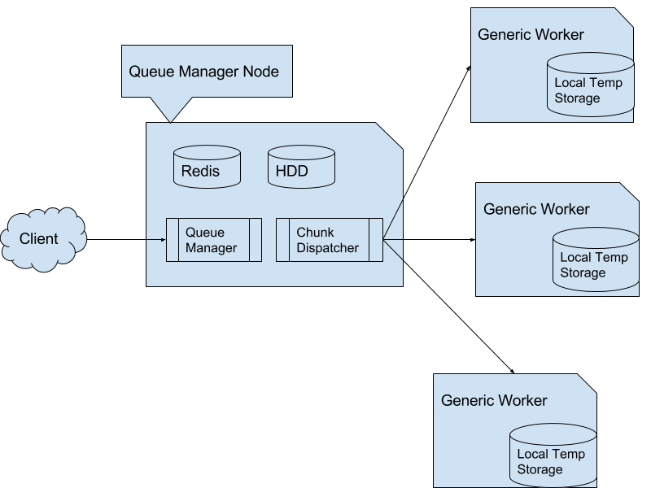
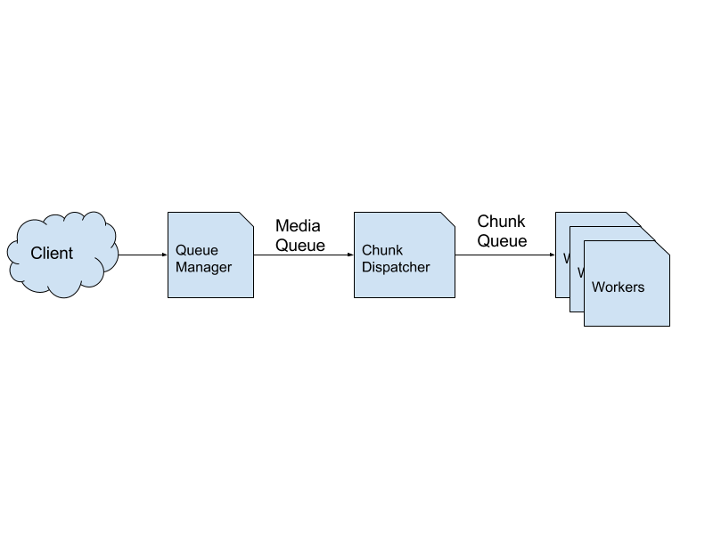

# Workflow Overview

Media url is submitted to Queue Manager via a RESTful API
Media job is picked up by Dispatcher
Dispatcher splits Media Job into multiple chunks: e.g. 10 minute video will be split into 120 chunks each five second long
Chunks are picked up from chunk queue by Workers
When workers are done the results are submitted to Queue and Cache Manager

# Deployment Diagram



# Logical Workflow Diagram



# Environment

* Ubuntu 14.04 LTS 64bit
* Available Storage approx 2MB per second of content
* Shared Database and Storage access for Queue Manager and Chunk Dispatcher
* No root access required
* Open port 8042 (configurable)

# Queue Manager Node

* Ubuntu 14.04 LTS 64bit
* Redis 3+
* Java 8
* Ffmpeg 2.8+ with SSL support

# Worker Nodes

* Ubuntu 14.04 LTS 64bit
* NodeJS 5.9+
* Ffmpeg 2.8+ with SSL support

# Queue Manager Node Setup

## Install java8

```
# apt-add-repository ppa:webupd8team/java
# apt-get install oracle-java8-installer
```

## Install Redis

Redis server should be of version 2.8.7 or higher (BITPOS command support) The one that comes with stock ubuntu 14.04 is outdated

```
# sudo add-apt-repository ppa:chris-lea/redis-server
# sudo apt-get update
# sudo apt-get install redis-server
```

## Install ffmpeg 

Download ffmpeg 2.8+ http://ffmpeg.org/download.html 
Build ffmpeg 
```
# ./ffmpeg_build.sh
```
Edit the script to point to ffmpeg 2.8.6 folder. Let the last line commented


# Download Application jar

cloud-0.1-uberjar.jar

# Create config file

`# vi config.json`

```json
{
  "redisDb": 0,
  "httpport": 8042,
  "httpsport": 8443,
  "redisHost": "zhuker.local",
  "websiteDomain": "zhuker.local:8042",
  "cloudfrontDomain": "zhuker.local:8042",
  "logsDir": "logs",
  "keystorePath": "c23.keystore",
  "keystorePassword": "123456",
  "sessionsDir": "sessions",
  "workerStorageDir": "/Users/zhukov/worker_storage/",
  "prodStorageDir": "/Users/zhukov/storage/",
  "ffmpeg": "/usr/local/bin/ffmpeg",
  "convert": "/usr/local/bin/convert",
  "ffprobe": "/usr/local/bin/ffprobe",
  "youtubedl": "/usr/local/bin/youtube-dl",
  "wsurl": "ws://zhuker.local:8042/ws/rtalk",
  "serverurl": "http://zhuker.local:8042",
  "cloudjar": "/Users/zhukov/git/cloud2398/cloud-uberjar.jar",
  "drawtext_fontfile": "/Library/Fonts/Arial.ttf",
  "fakem9k": true
}
```


# Start Queue Manager

```
# java -cp cloud-717-uberjar.jar -Dffmpeg=/home/ubuntu/cloud2398/ffmpeg-2.8.6/ffmpeg -Dffprobe=/home/ubuntu/cloud2398/ffmpeg-2.8.6/ffprobe com.vg.cloud.CloudWebServerMain 
```

# Start Dispatcher

```
# java -cp cloud-717-uberjar.jar -Dffmpeg=/home/ubuntu/cloud2398/ffmpeg-2.8.6/ffmpeg -Dffprobe=/home/ubuntu/cloud2398/ffmpeg-2.8.6/ffprobe  com.vg.cloud.DispatcherMain
```

# Start Workers

See [Worker Guide](workers.md)

